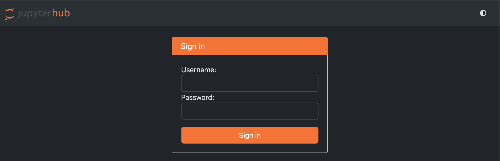
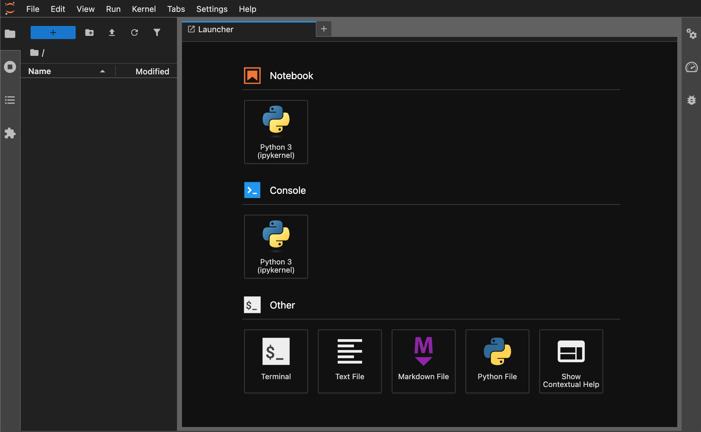
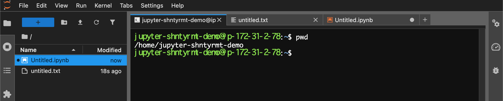
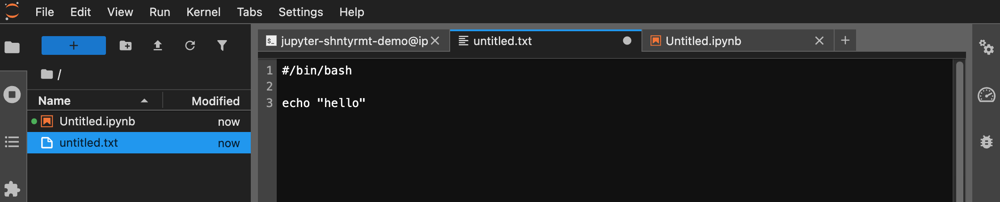
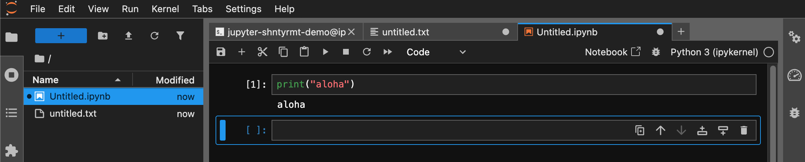
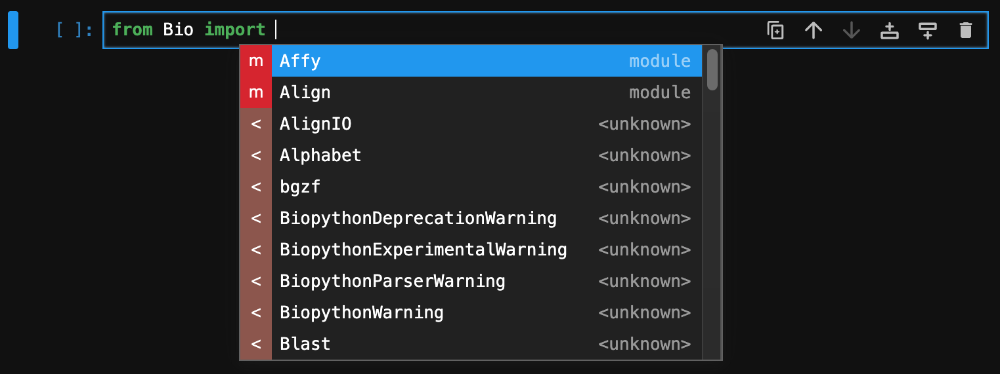
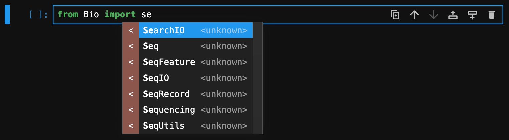

# JupyterHub / JupyterLab の使い方

---

## 目次

1. [実習環境について](#1-実習環境について)
2. [ログイン](#2-ログイン)
3. [ランチャー画面](#3-ランチャー画面)
4. [ターミナルを開く](#4-ターミナルを開く)
5. [テキストファイルを開く](#5-テキストファイルを開く)
6. [Jupyter Notebook を使う](#6-jupyter-notebook-を使う)

---

## 1. 実習環境について

本講座では、Amazon AWS クラウド上に構築した Linux サーバーを実習環境として使用します。このサーバーには **JupyterHub** がインストールされています。JupyterHub は、複数のユーザーが同時にログインして作業できるプラットフォームです。

ログイン後に起動するインターフェースが **JupyterLab** です。JupyterLab はブラウザ上でターミナル操作・テキスト編集・Python コードの実行をまとめて行える環境で、本講座の実習はすべてここで行います。

> ⚠️ **ブラウザについて**: 動作の安定性のため、本講座では **Google Chrome** を使用してください。他のブラウザでは正常に動作しない場合があります。

---

## 2. ログイン

ユーザー名とパスワードは事前にメールでお知らせします。講師から配布された URL にアクセスし、ログインしてください。

---

## 3. ランチャー画面

ログインすると**ランチャー**画面が表示されます。ここから各ツールを起動します。

新しいランチャーを開くには、左上の **`+`** ボタンをクリックします。

---

## 4. ターミナルを開く

ランチャーの Other → **Terminal** をクリックするとターミナルが起動します。

---

## 5. テキストファイルを開く

ランチャーの Other → **Text File** をクリックすると、テキストエディタが開きます。

ファイルは `Command + S`で保存できます。

---

## 6. Jupyter Notebook を使う

### ノートブックを開く

ランチャーの Notebook → **Python 3 (ipykernel)** をクリックすると、新しい Jupyter Notebook が開きます。

### セルの実行

Notebook はコード・テキストを記述する**セル**（Cell）単位で構成されます。

| 操作 | キー |
|------|------|
| セルを実行して次へ移動 | `Shift + Return` |
| セルを実行して移動しない | `Command + Return` |

### タブ補完

コードの途中で **Tab キー**を押すと、関数名や変数名の候補が表示されます。スペルミスの防止にも役立ちます。

---
