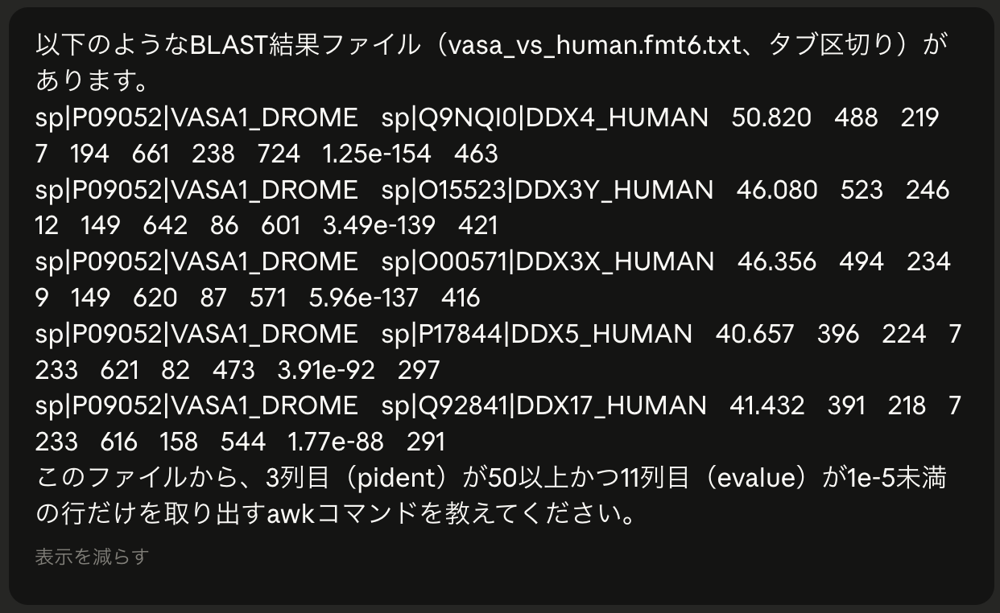
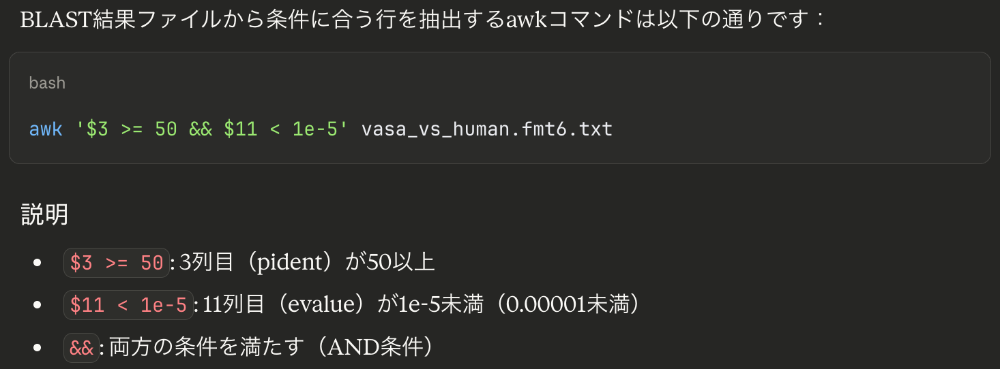

# 第５章 UNIX中級

---

## 目次

1. [検索と集計：grep と wc](#1-検索と集計grep-と-wc)
2. [標準入出力とリダイレクト](#2-標準入出力とリダイレクト)
3. [パイプ](#3-パイプ)
4. [テキスト処理：cut・sort・uniq](#4-テキスト処理cutsortuniq)
5. [テキスト処理：sed・awk](#5-テキスト処理sedawk)
6. [正規表現の基礎](#6-正規表現の基礎)
7. [AIを使ったコマンド作成](#7-aiを使ったコマンド作成)

---

## 1. 検索と集計：grep と wc

### 行数・文字数の計測：`wc`

**wc** (Word Count) でファイルのサイズ感を把握します。

```bash
$ wc proteins.fasta
 120  890 5230 proteins.fasta
# 行数  単語数  文字数  ファイル名

$ wc -l proteins.fasta     # 行数だけ表示
```

### パターン検索：`grep`

**grep** (Global Regular Expression Print) は、指定したパターンを含む行を抽出します。

```bash
$ grep "Buchnera aphidicola" proteins.fasta    # "Buchnera aphidicola" を含む行を表示
$ grep -c "^>" proteins.fasta                  # ">" で始まる行の数（= 配列数）を表示
```

よく使うオプション：

| オプション | 説明 | 例 |
|-----------|------|-----|
| `-i` | 大文字・小文字を区別しない | `grep -i "ecoli"` |
| `-v` | マッチしない行を表示（除外） | `grep -v "^>"` |
| `-c` | マッチした行数を表示 | `grep -c "^>"` |

---

## 2. 標準入出力とリダイレクト

### 標準入出力

UNIXのコマンドは、データの流れとして以下の3つを持っています。

| 名称 | 略称 | 内容 |
|------|------|------|
| 標準入力 | stdin | コマンドへの入力（デフォルト：キーボード） |
| 標準出力 | stdout | コマンドの通常の出力（デフォルト：ディスプレイ） |
| 標準エラー出力 | stderr | エラーメッセージの出力（デフォルト：ディスプレイ） |

### リダイレクト

リダイレクトを使うと、標準出力の行き先をファイルに変更できます。

```bash
$ grep "^>" proteins.fasta > headers.txt     # 上書き保存（既存ファイルは消える）
$ grep "^>" cds.fasta >> headers.txt         # 追記（ファイルの末尾に追加）
$ grep "error" blast_out.log 2> errors.txt   # 標準エラー出力をファイルへ
```

| 記号 | 意味 |
|------|------|
| `>`  | 標準出力をファイルに書き込む（上書き） |
| `>>` | 標準出力をファイルに追記する |
| `2>` | 標準エラー出力をファイルに書き込む |

> ⚠️ **注意**: `>` はファイルの中身を**上書き**します。既存ファイルを誤って消さないよう注意しましょう。

---

## 3. パイプ

### パイプとは

**パイプ**（`|`）は、あるコマンドの**標準出力を次のコマンドの標準入力として渡す**仕組みです。シンプルなコマンドを組み合わせて複雑な処理を実現できます。これがUNIXの最大の強みのひとつです。

```
コマンド1 | コマンド2 | コマンド3 ...
```

### 使用例

```bash
# FASTAファイルのヘッダ行を取り出して行数（= 配列数）を数える
$ grep "^>" proteins.fasta | wc -l
5

# ヘッダ行を less でスクロール表示
$ grep "^>" proteins.fasta | less

# 特定の生物種のエントリだけ取り出す
$ grep "^>" proteins.fasta | grep "Buchnera aphidicola"
```

パイプは何段でも連結できます。`\` で行を折り返して書くと読みやすくなります。

```bash
# proteins.fasta のヘッダ行を取り出して重複なく一覧表示
$ grep "^>" proteins.fasta \
    | grep -v "archaea" \
    | sort \
    | uniq
```

---

## 4. テキスト処理：cut・sort・uniq

### 列を取り出す：`cut`

タブや特定の区切り文字で区切られたファイルから、特定の列を取り出します。

```bash
$ cut -f 1,2 blast_results.tsv       # タブ区切りの1列目と2列目を取得
$ cut -d "," -f 2 data.csv           # カンマ区切りの2列目（-d で区切り文字指定）
```

### 並び替え：`sort`

```bash
$ sort blast_results.tsv              # 先頭から比較してソート
$ sort -r blast_results.tsv           # 逆順にソート
$ sort -k 3 -n -r blast_results.tsv   # 3列目（同一性）を数値として降順ソート
$ sort -k 11 -g blast_results.tsv     # 11列目（E-value）で昇順ソート（-g: 科学的表記対応）
```

```bash
# 3列目（同一性）を数値として降順ソート
$ sort -k 3 -n -r vasa_vs_human.fmt6.txt| head -n 5
sp|P09052|VASA1_DROME	sp|Q9NR30|DDX21_HUMAN	54.054	37	16	1	94	130	718	753	6.6	29.6
sp|P09052|VASA1_DROME	sp|Q04637|IF4G1_HUMAN	52.941	34	14	1	141	172	1142	1175	0.47	33.5
sp|P09052|VASA1_DROME	sp|Q96PE2|ARHGH_HUMAN	51.613	31	14	1	81	110	268	298	2.3	31.2
sp|P09052|VASA1_DROME	sp|Q9NQI0|DDX4_HUMAN	50.820	488	219	7	194	661	238	724	1.25e-154	463
sp|P09052|VASA1_DROME	sp|Q9NR30|DDX21_HUMAN	50.000	46	20	1	75	117	716	761	0.30	33.9
...
```

### 重複を取り除く・数える：`uniq`

`uniq` は**隣接する重複行**のみを処理します。必ず `sort` と組み合わせて使います。

```bash
$ sort species.txt | uniq           # 重複を除いた一覧
$ sort species.txt | uniq -c        # 各項目の出現回数（頭に数字が付く）
$ sort species.txt | uniq -d        # 重複している行だけ表示
```

```bash
# vasa遺伝子にヒットしたヒトの遺伝子数
$ cut -f 2 vasa_vs_human.fmt6.txt | sort | uniq | wc -l
      77
```

---

## 5. テキスト処理：sed・awk

### 文字列の置換・削除：`sed`

**sed** (Stream EDitor) は、ファイルを1行ずつ読み込みながら、パターンに合った処理を行うツールです。

```bash
# 基本構文（s = substitute）
$ sed 's/置換前/置換後/' ファイル名      # 各行の最初のマッチのみ置換
$ sed 's/置換前/置換後/g' ファイル名     # g（global）: 各行の全マッチを置換
```

```bash
# FASTAヘッダを短くする（最初の空白以降を削除）
$ sed 's/ .*//' proteins.fasta

# スペースをアンダースコアに変換（各行の全スペースを置換）
$ sed 's/ /_/g' data.txt
```

### 列単位のデータ処理：`awk`

**awk** は、列単位のデータ処理に特化したツールです。`$1`, `$2`, ... で各列を参照でき、条件に合った行だけ処理できます。

```bash
# 基本構文
$ awk '{ 処理 }' ファイル名
$ awk '条件 { 処理 }' ファイル名
```

```bash
# 1列目と3列目を表示
$ awk '{ print $1, $3 }' blast_results.tsv

# タブ区切りを明示（-F）
$ awk -F '\t' '{ print $1, $3 }' blast_results.tsv

# 同一性（3列目）が80%以上のヒットだけ表示
$ awk '$3 >= 80 { print $1, $2, $3 }' blast_results.tsv

# 同一性80%以上 かつ E-value < 1e-5 の行を表示
$ awk '$3 >= 80 && $11 < 1e-5 { print }' blast_results.tsv
```

**例**：同一性90%以上のヒットをE-value昇順で表示する

```bash
$ awk '$3 >= 90 { print }' blast_results.tsv | sort -k 11 -g
```

---

## 6. 正規表現の基礎

**正規表現**（Regular Expression）は、文字列のパターンを表現するための記法です。`grep`、`sed`、`awk` などで利用できます。

### 基本メタ文字（grep でそのまま使える）

| メタ文字 | 意味 | 例 |
|---------|------|-----|
| `.` | 任意の1文字 | `A.G` → ACG, ATG, AGG など |
| `*` | 直前の文字の0回以上の繰り返し | `AC*G` → AG, ACG, ACCG など |
| `^` | 行の先頭 | `^>` → `>` で始まる行 |
| `$` | 行の末尾 | `TAA$` → TAA で終わる行 |
| `[...]` | 括弧内のいずれか1文字 | `[ATGC]` → A, T, G, C のどれか |
| `[^...]` | 括弧内の文字以外 | `[^ATGC]` → A, T, G, C 以外 |

### 拡張メタ文字（`grep -E` が必要）

以下のメタ文字は、`grep -E`（拡張正規表現）を指定しないと使えません。

| メタ文字 | 意味 | 例 |
|---------|------|-----|
| `+` | 直前の文字の1回以上の繰り返し | `AC+G` → ACG, ACCG など |
| `?` | 直前の文字の0回または1回 | `AC?G` → AG, ACG |
| `{n,}` | 直前の文字のn回以上の繰り返し | `[A-Z]{3,}` → 大文字3文字以上 |
| `(...)` | グループ化 | `(AT)+` → AT, ATAT, ATATAT |
| `\|` | または | `TAA\|TAG\|TGA`（`-E` オプション使用時） |

---

## 7. AIを使ったコマンド作成

`sed` や `awk`、正規表現は強力なツールですが、構文を覚えるのに時間がかかりますし、しばらく使っていないと忘れてしまいます。実際の現場では、**生成AIを使ってコマンドを作成する**ことも有効な手段です。

### 効果的なプロンプトの書き方

AIにコマンドを作ってもらうときは、以下の情報を伝えると精度が上がります。

1. **入力ファイルの構成**：タブ区切り、何列あるかなど
2. **やりたいこと**：何列目を取り出したいか、条件は何かなど
3. **出力のイメージ**：どんな結果が欲しいか

**プロンプトと出力例 (Claude)**





AIの出力は必ずしも正しいとは限りません。**必ず自分で確認してから実行**しましょう。

---

## まとめ：本セクションで学んだコマンド・記号

| カテゴリ | コマンド・記号 | 主な用途 |
|---------|--------------|---------|
| 検索・集計 | `grep`, `wc` | パターン検索、行数・文字数の計測 |
| リダイレクト | `>`, `>>`, `2>` | 出力をファイルに保存・追記 |
| パイプ | `\|` | コマンドの出力を次のコマンドへ渡す |
| テキスト処理（基本） | `cut`, `sort`, `uniq` | 列抽出、並び替え、重複処理 |
| テキスト処理（高度） | `sed`, `awk` | 文字列置換、条件付き列処理 |

---
