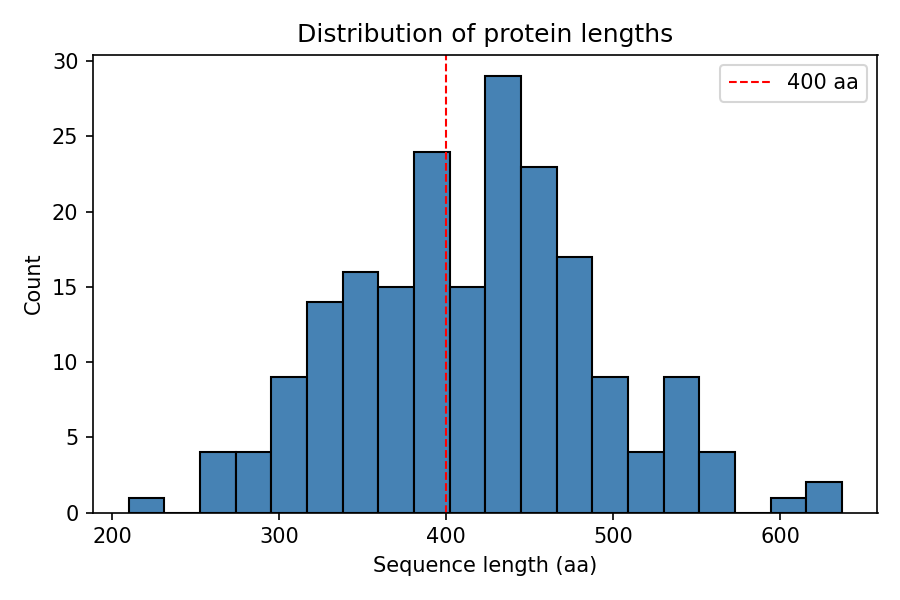
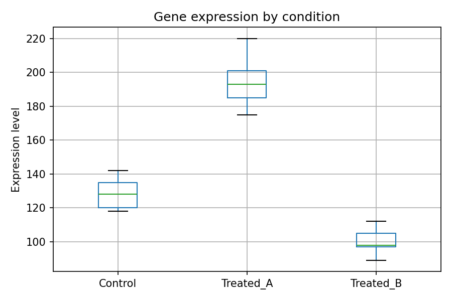
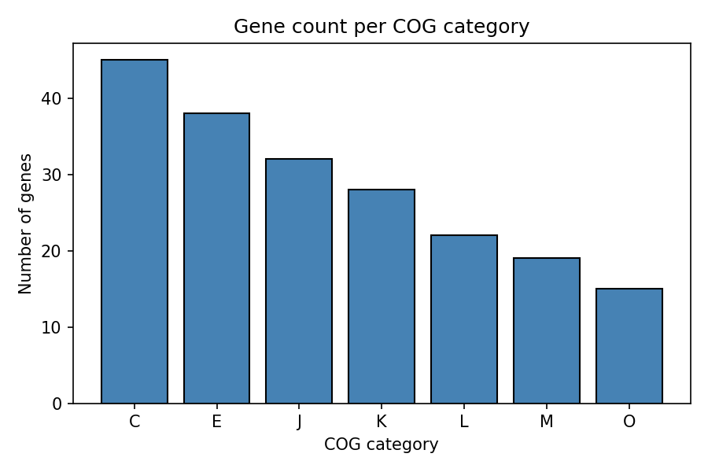
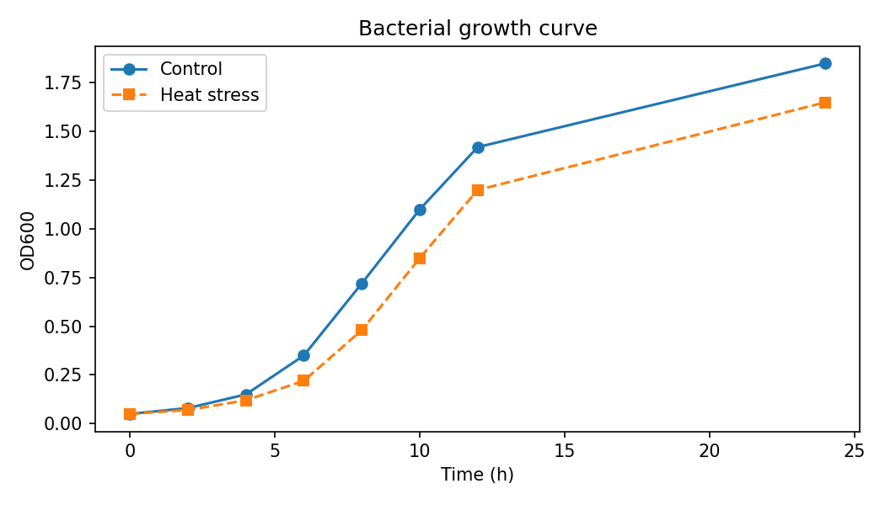
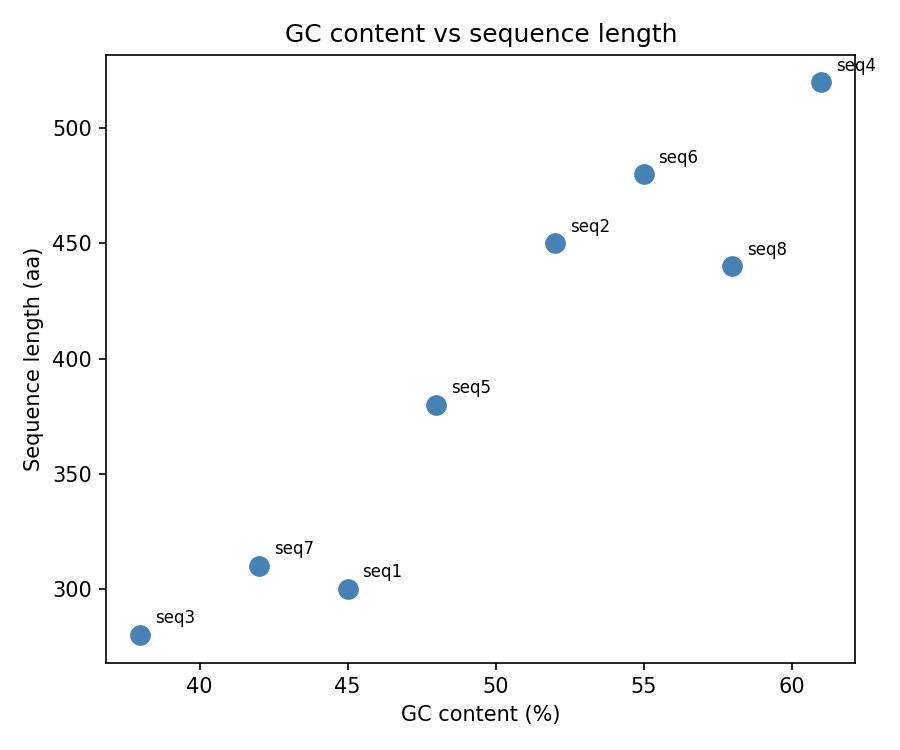
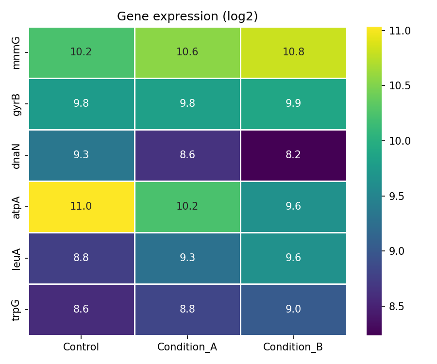

# 第12章 Matplotlib・Seaborn

---

## 目次

1. [ヒストグラム](#1-ヒストグラム)
2. [ボックスプロット](#2-ボックスプロット)
3. [棒グラフ](#3-棒グラフ)
4. [折れ線グラフ](#4-折れ線グラフ)
5. [散布図](#5-散布図)
6. [ヒートマップ](#6-ヒートマップ)

---

## ライブラリのインポート

```python
import numpy as np
import pandas as pd
import matplotlib.pyplot as plt
import seaborn as sns
```

---

## 1. ヒストグラム

値の**分布**を確認するときに使います。GC含量・配列長・品質スコアなど、多数の値がどの範囲に集中しているかを一目で把握できます。

```python
# タンパク質 200 件の配列長（正規分布で擬似生成）
np.random.seed(42)
lengths = np.random.normal(loc=420, scale=80, size=200).astype(int)

plt.figure(figsize=(6, 4))          # プロット領域のサイズ（インチ）を指定して用意する
plt.hist(lengths, bins=20, edgecolor="black", color="steelblue")
plt.axvline(400, color="red", linestyle="--", linewidth=1, label="400 aa")
plt.xlabel("Sequence length (aa)")  # x 軸ラベル
plt.ylabel("Count")                 # y 軸ラベル
plt.title("Distribution of protein lengths")  # グラフタイトル
plt.legend()                        # 凡例を表示
plt.tight_layout()                  # 余白を自動調整
plt.savefig("protein_lengths.png", dpi=150, bbox_inches="tight")  # PNG に保存
plt.show()                          # グラフを表示
```



> **`plt.savefig()`**: グラフをファイルに保存します。`plt.show()` の**前**に呼ぶ必要があります（show() 後は図がクリアされます）。
> `dpi=` で解像度、`bbox_inches="tight"` でラベルが切れないよう余白を自動調整します。

> **`plt.axvline(x, ...)`**: 指定した x 座標に垂直な参照線を引きます。閾値や平均値を視覚的に示すときによく使います。

---

## 2. ボックスプロット

**複数のグループ間で分布を比較**するときに使います。中央値・四分位範囲・外れ値がひとつの図で確認できます。

```python
# 3条件 × 5リプリケートの遺伝子発現量（仮データ）
data = {
    "Control":   [120, 135, 118, 142, 128],
    "Treated_A": [185, 201, 175, 220, 193],
    "Treated_B": [ 98, 112,  89, 105,  97],
}
df = pd.DataFrame(data)

plt.figure(figsize=(6, 4))
df.boxplot()                        # DataFrame の各列をボックスプロットとして描く
plt.ylabel("Expression level")
plt.title("Gene expression by condition")
plt.tight_layout()
plt.show()
```



---

## 3. 棒グラフ

**カテゴリ別の集計値**を比較するときに使います。COG カテゴリ別遺伝子数や、条件間の遺伝子数の比較などに向いています。

```python
# COG カテゴリ別遺伝子数（仮データ）
categories = ["C", "E", "J", "K", "L", "M", "O"]
counts     = [45,  38,  32,  28,  22,  19,  15]

plt.figure(figsize=(6, 4))
plt.bar(categories, counts, color="steelblue", edgecolor="black")  # 棒グラフを描く
plt.xlabel("COG category")
plt.ylabel("Number of genes")
plt.title("Gene count per COG category")
plt.tight_layout()
plt.show()
```



> **COG カテゴリ**: C = エネルギー産生、E = アミノ酸代謝、J = 翻訳、K = 転写、L = DNA複製・修復 など。

---

## 4. 折れ線グラフ

**時系列データや連続的な変化**を可視化するときに使います。

```python
# 細菌の増殖曲線（仮データ）
time     = [ 0,    2,    4,    6,    8,   10,   12,   24]
od_ctrl  = [0.05, 0.08, 0.15, 0.35, 0.72, 1.10, 1.42, 1.85]
od_heat  = [0.05, 0.07, 0.12, 0.22, 0.48, 0.85, 1.20, 1.65]

plt.figure(figsize=(7, 4))
plt.plot(time, od_ctrl, marker="o", label="Control")              # 折れ線グラフを描く
plt.plot(time, od_heat, marker="s", label="Heat stress", linestyle="--")
plt.xlabel("Time (h)")
plt.ylabel("OD600")
plt.title("Bacterial growth curve")
plt.legend()
plt.tight_layout()
plt.show()
```



| 引数 | 役割 |
|------|------|
| `marker=` | データ点の形（`"o"` 丸, `"s"` 四角, `"^"` 三角など） |
| `linestyle=` | 線の種類（`"-"` 実線, `"--"` 破線, `":"` 点線） |
| `label=` | 凡例に表示するラベル |

---

## 5. 散布図

**2変数の関係**（相関や分布の偏り）を確認するときに使います。

```python
# 8配列の GC含量と配列長（仮データ）
gc      = [45, 52, 38, 61, 48, 55, 42, 58]
lengths = [300, 450, 280, 520, 380, 480, 310, 440]
labels  = ["seq1", "seq2", "seq3", "seq4",
           "seq5", "seq6", "seq7", "seq8"]

plt.figure(figsize=(6, 5))
plt.scatter(gc, lengths, color="steelblue", s=80)  # 散布図を描く（s= は点のサイズ）

# 各点に配列名をラベルとして付ける
for i, label in enumerate(labels):
    plt.text(gc[i] + 0.5, lengths[i] + 5, label, fontsize=8)  # 任意の座標にテキストを追加

plt.xlabel("GC content (%)")
plt.ylabel("Sequence length (aa)")
plt.title("GC content vs sequence length")
plt.tight_layout()
plt.show()
```



---

## 6. ヒートマップ

**行列形式のデータ**（遺伝子 × サンプル、相関行列など）を色で可視化するときに使います。Seaborn の `heatmap()` を使うと少ないコードで描けます。

```python
# 発現量データ（6遺伝子 × 3サンプル）
expression_df = pd.DataFrame({
    "Control":     [1200,  870, 650, 2100, 430, 380],
    "Condition_A": [1500,  900, 400, 1200, 620, 450],
    "Condition_B": [1800,  950, 300,  800, 800, 520],
}, index=["mnmG", "gyrB", "dnaN", "atpA", "leuA", "trpG"])

# log2 変換（発現量データでは一般的）
log_expr = np.log2(expression_df + 1)   # +1 はゼロの発現量でlog(0)が-∞になるのを防ぐため（疑似カウント）

plt.figure(figsize=(6, 5))
sns.heatmap(               # Seaborn でヒートマップを描く
    log_expr,
    annot=True,            # 各セルに数値を表示
    fmt=".1f",             # 小数1桁
    cmap="viridis",        # カラーマップ
    linewidths=0.5
)
plt.title("Gene expression (log2)")
plt.tight_layout()
plt.show()
```



> **`cmap=`**: カラーマップを指定します。`"viridis"`（青→黄）、`"RdBu_r"`（青→赤）、`"Blues"` などがよく使われます。

---

## まとめ

| グラフ | 関数 |
|--------|------|
| ヒストグラム | `plt.hist()` |
| ボックスプロット | `df.boxplot()` |
| 棒グラフ | `plt.bar()` |
| 折れ線グラフ | `plt.plot()` |
| 散布図 | `plt.scatter()` |
| ヒートマップ | `sns.heatmap()` |
