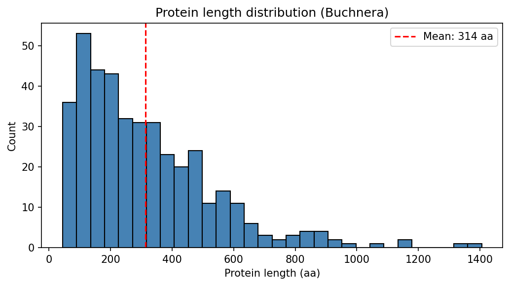
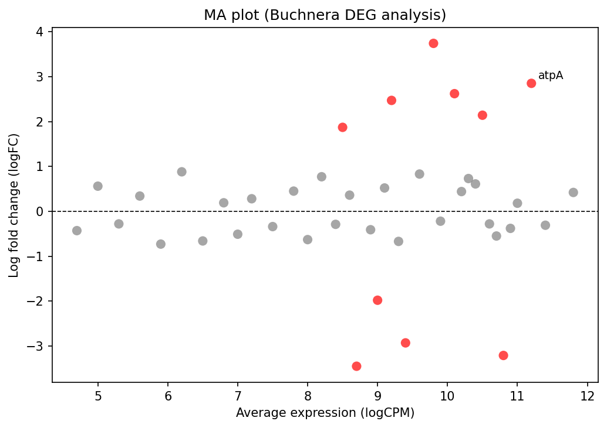

# 復習問題12：Matplotlib・Seaborn

データの可視化を練習します。グラフは PNG ファイルに保存してください。

---

## 準備

```bash
mkdir ~/work/ex12
cp ~/data/ex01/buchnera_cj.faa.gz ~/work/ex12/
cp ~/data/ex12/deg_large.tsv ~/work/ex12/
cd ~/work/ex12
gunzip buchnera_cj.faa.gz
ls
```

---

## 問1：Buchnera タンパク質長のヒストグラム

`buchnera_cj.faa` にはササコナフキツノアブラムシの *Buchnera aphidicola* の全タンパク質配列（403 件）が含まれています。

`SeqIO.parse()` で配列を読み込み、全配列の長さ（アミノ酸数）のヒストグラムを描いてください。

**設定：**

- タイトル：`"Protein length distribution (Buchnera)"`
- x 軸ラベル：`"Protein length (aa)"`
- y 軸ラベル：`"Count"`
- `plt.axvline()` で平均値に垂直な参照線を引く
- `protein_lengths.png` に保存

**出力例：**



<details>
<summary>ヒント</summary>

```python
from Bio import SeqIO
# SeqIO.parse() でファイルを読み込み、len(record) で配列長を取得できる
lengths = []
for record in SeqIO.parse("buchnera_cj.faa", "fasta"):
    lengths.append(len(record))
```

</details>

<details>
<summary>解答例</summary>

```python
import matplotlib.pyplot as plt
import numpy as np
from Bio import SeqIO

lengths = []
for record in SeqIO.parse("buchnera_cj.faa", "fasta"):
    lengths.append(len(record))

mean_len = np.mean(lengths)

plt.figure(figsize=(7, 4))
plt.hist(lengths, bins=30, edgecolor="black", color="steelblue")
plt.axvline(mean_len, color="red", linestyle="--", linewidth=1.5,
            label=f"Mean: {mean_len:.0f} aa")
plt.xlabel("Protein length (aa)")
plt.ylabel("Count")
plt.title("Protein length distribution (Buchnera)")
plt.legend()
plt.tight_layout()
plt.savefig("protein_lengths.png", dpi=150, bbox_inches="tight")
plt.show()
```

</details>

---

## 問2：DEG 結果の MA plot

**MA plot** は RNA-seq の発現変動解析でよく使われる散布図です。

- **X 軸（A）**: 平均発現量（logCPM）— 横軸に全サンプルでの平均的な発現量を取ります
- **Y 軸（M）**: 発現変動量（logFC）— 縦軸に条件間の発現量の変化を取ります
- 有意な遺伝子（FDR < 0.05）を色分けして強調することで、どの遺伝子が発現変動しているかを一目で把握できます

`deg_large.tsv` を Pandas で読み込み、MA plot を描いてください。

**設定：**

- FDR < 0.05 の遺伝子を赤（`"red"`）、それ以外を灰色（`"gray"`）で表示
- `plt.axhline(0, ...)` で y=0 の参照線を引く
- `atpA` のみ点の横にテキストラベルを表示する
- タイトル：`"MA plot (Buchnera DEG analysis)"`
- x 軸ラベル：`"Average expression (logCPM)"`
- y 軸ラベル：`"Log fold change (logFC)"`
- `ma_plot.png` に保存

**新しく使う機能： テキストラベルの追加**

`df[df["gene_id"] == "atpA"]` は `gene_id` 列が `"atpA"` である行だけを抽出した DataFrame です。`.iloc[0]` はその先頭行（= 1行目）を Series として取り出します。

```python
atpA = df[df["gene_id"] == "atpA"].iloc[0]  # atpA の行を取り出す
```

`plt.text(x, y, テキスト)` は、グラフ上の座標 `(x, y)` に文字列を書き込みます。点と重ならないよう、座標に少しずらした値を指定します。

```python
plt.text(atpA["logCPM"] + 0.1, atpA["logFC"] + 0.1, "atpA", fontsize=9)
```

**出力例：**



<details>/
<summary>ヒント</summary>

```python
import pandas as pd
df = pd.read_csv("deg_large.tsv", sep="\t")

# 各遺伝子の FDR 値に応じて色を決める
colors = ["red" if fdr < 0.05 else "gray" for fdr in df["FDR"]]
plt.scatter(df["logCPM"], df["logFC"], c=colors, ...)
```

</details>

<details>
<summary>解答例</summary>

```python
import matplotlib.pyplot as plt
import pandas as pd

df = pd.read_csv("deg_large.tsv", sep="\t")

colors = ["red" if fdr < 0.05 else "gray" for fdr in df["FDR"]]

plt.figure(figsize=(7, 5))
plt.scatter(df["logCPM"], df["logFC"], c=colors, alpha=0.7, s=60, edgecolors="none")
plt.axhline(0, color="black", linewidth=0.8, linestyle="--")
plt.xlabel("Average expression (logCPM)")
plt.ylabel("Log fold change (logFC)")
plt.title("MA plot (Buchnera DEG analysis)")

# atpA のみラベルを付ける
atpA = df[df["gene_id"] == "atpA"].iloc[0]
plt.text(atpA["logCPM"] + 0.1, atpA["logFC"] + 0.1, "atpA", fontsize=9)
plt.tight_layout()
plt.savefig("ma_plot.png", dpi=150, bbox_inches="tight")
plt.show()
```

</details>

---
